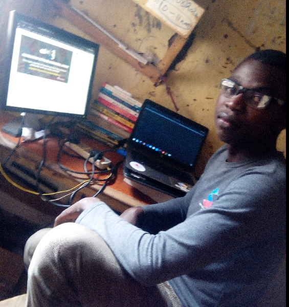

 An **Engineer** is someone who went to know **how** and **why** things work, beside been naturally curious, An **Engineer** A Person who Designs and Builds things to solve a specific problems
 # Engineer ask 3 important question when they are working 
 1. **what** is the problem that needs to be solved ?
 2. **who** has the problem that needs to be solved ?
 3. **why** is problem this important to solved ?    
 
 # Software Engineers 
 they design and Create computer system and application to solve **real world problems**
 # Software Engineering  
   is the branch of computer science that deals with the design, developments,testing, and maintenance of software application.
      Software Engineers apply engineering principal and knowledge of computer programming language to build a software solution for end users
# there Tasks
- Evaluating and testing new software programs
- optimizing software for speed and scalability
-  writing and testing code
-  consulting with client, Engineers,Security specialist and other stakeholders
-  presenting new features to internal customers
  
# General classification of software Engineers
1. System Developer
2. Application Developer

# System Developer Task
- Ensuring that different types of software communicate with each other on one platform
- Maintaining Documentation of information technology system
- updating to new technologies as needed
- collaborating with development teams: senior system architects, and Data science professional
# Application Developer Task
- Developing application for Ios,Android,Windows or other Os
- conduction An analysis of requirement and tweaking software as needed
- Releasing software updates
- working with Graphic designers, customers services, staff,project manager, and other customer facing departments
  
# Skills require as Software Engineers
to achieve all the above mention task as software Engineer to Deliver as secure reliable scalable software
you most have a strong **technical skills(hard skills)** of computer science, And not only that you most also have **soft skills** that would enable you to interact with both Development team and end-users to get feedback and build the software that solve actual intent problem 
1. # hard Skills
   you need a strong knowledge of computer science that would enable you to build:
   - server
   - marketplace
   - blockchain
   - website
   - configure a chat bot e.t.c
all these would not be possible without strong hard skills of computer science such as:
- programming
- version control
- object Oriented programming
- Data Structure and Algorithms
- Database architecture
- operating system
- cloud computing
- Agile and Scrum project management
- Test and Debugging
- Attention to details

# Soft skills
**Soft skills** are skills applicable to all professions.Skills like communication, collaboration, adaptability, and problem-solving – commonly called “soft” skills – are now so essential to success in IT, The ability to think creatively and solve problems by working with others is really important,