# Git and Github

**Git** is the free and open source distributed version control system that's responsible for everything GitHub related that happens locally on your computer.

**Version Control System** (VCS) is a software that helps software developers to work together and maintain a complete history of their work.

## functions of a VCS: 

- Allows developers to work simultaneously.
- Does not allow overwriting each other’s changes. 
- Maintains a history of every version

Following are the types of VCS:
1. Centralized version control system (CVCS).
2.  Distributed/Decentralized version control system (DVCS).

**Git falls under distributed version control system**.

## Centralized version control system (CVCS)
uses a central server to store all files and enables team collaboration. But the major drawback of CVCS is its single point of failure, i.e., failure of the central server. 

Unfortunately, if the central server goes down for an hour, then during that hour, no one can collaborate at all. And even in a worst case, if the disk of the central server gets corrupted and proper backup has not been taken, then you will lose the entire history of the project.

## Distributed Version Control System (DVCS) 

comes into picture. DVCS clients not only check out the latest snapshot of the directory but they also fully mirror the repository. 

If the sever goes down, then the repository from any client can be copied back to the server to restore it, Every checkout is a full backup of the repository. 

**Git** does not rely on the central server and that is why you can perform many operations when you are offline. 
- You can commit changes,
- create branches, 
- view logs, 
- and perform other operations when you are offline. 

**You require network connection only to publish your changes and take the latest changes.**

## GIT ENVIRONMENT SETUP 

- [Download](https://git-scm.com/downloads)

- Double click to install Git on your windows Computer The windows will appear like this blow

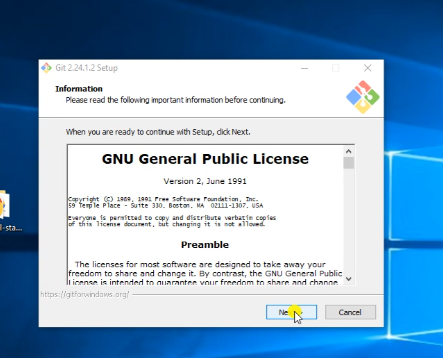

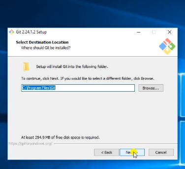

**By default Git will choose C:program Files\Git**

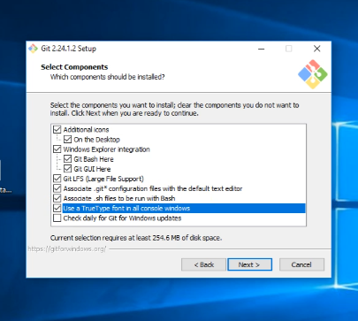

check the following

- [x] On the Desktop
- [x] Windows Explorer integration
- [x] Git Bash Here
- [x] Git GUI Here
- [x] Git LFS (large file support)
- [x] Associate .git configuration file with default text editor
- [x] Associate .sh file to be run with bash
- [x] Use a TrueType font in all console windows

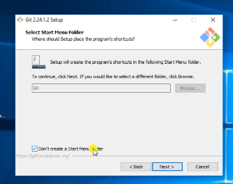

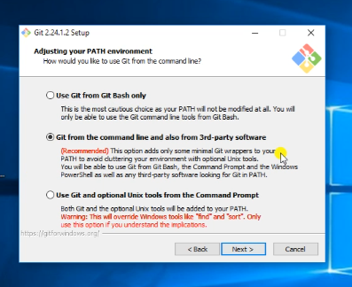

BY DEFULT Git use **vim text Editor**

**VIM** :- is a free and open source text editor, unlike other text Editors vim can be used directly from command line interface even though it also has a graphical interface

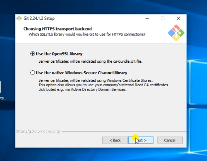

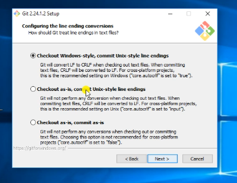

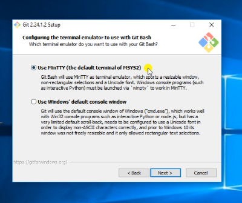

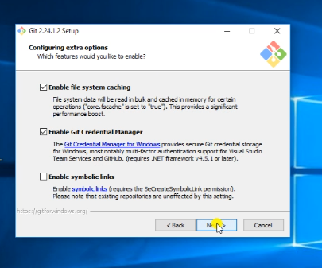

Check  

- [x] Enable file system caching • Enable git creadentials

- [x] git-credential Retrieve and store user credentials such as username Email and password

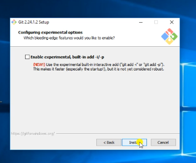

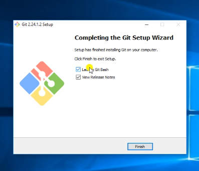

**Finally click on finish*

**now you are ready to work in collaborative Distributed Development Environment**

locally on your computer
