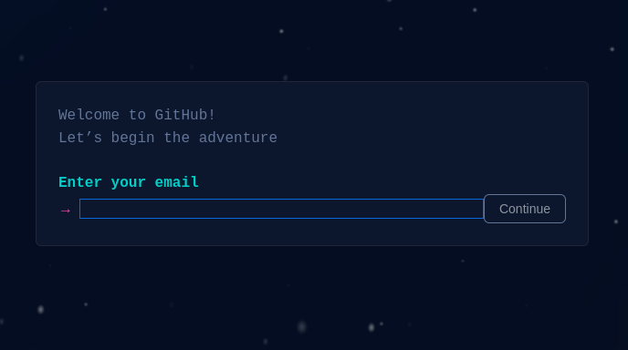
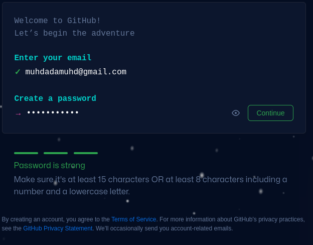
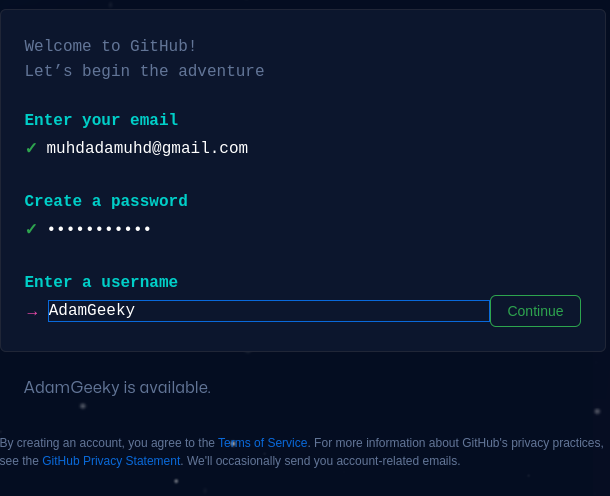
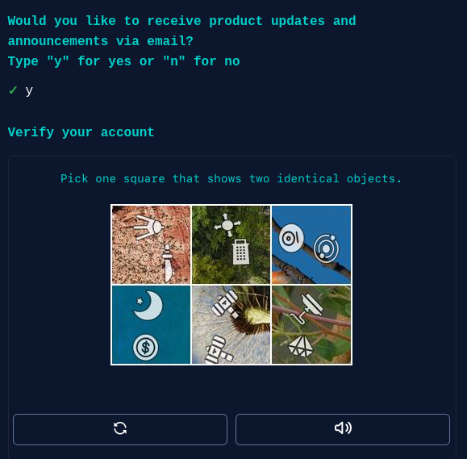
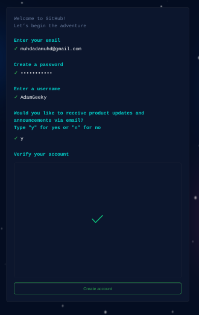
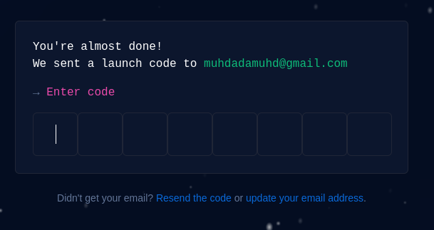

# Introduction to GitHub 

## What is GitHub?: 

GitHub is a collaboration platform that uses Git for versioning. GitHub is a popular place to share and contribute to open-source software.

It's a social networking site for programmers that many companies and organizations use to facilitate project management and collaboration

It is the world’s largest coding community. Putting a code or a project into GitHub brings it increased, widespread exposure. Programmers can find source codes in many different languages and use the command-line interface, **Git**, to make and keep track of any changes.

## What are GitHub’s Features?

1. ### Easy Project Management
GitHub is a place where project managers and developers come together to coordinate, track, and update their work so that projects are transparent and stay on schedule.

2. ### Increased Safety With Packages
Packages can be published privately, within the team, or publicly to the open-source community. The packages can be used or reused by downloading them from GitHub.

3. ### Effective Team Management
GitHub helps all the team members stay on the same page and organized. Moderation tools like Issue and Pull Request Locking help the team to focus on the code.

4. ### Improved Code Writing
Pull requests help the organizations to review, develop, and propose new code. Team members can discuss any implementations and proposals through these before changing the source code.

5. ### Increased Code Safety
GitHub uses dedicated tools to identify and analyze vulnerabilities to the code that other tools tend to miss. Development teams everywhere work together to secure the software supply chain, from start to finish.

6. ### Easy Code Hosting
All the code and documentation are in one place. There are millions of repositories on GitHub, and each repository has its own tools to help you host and release code.

**infact this project is All host on github from source code to website hosting**

What is a commit?: A commit is a set of changes to the files and folders in your project. A commit exists in a branch.

What is a profile README?: A profile README is essentially an "About me" section on your GitHub profile where you can share information about yourself with the community on GitHub.com. GitHub shows your profile README at the top of your profile page.

[Github Sign up](https://github.com/signup?source=login)

<!--  -->

