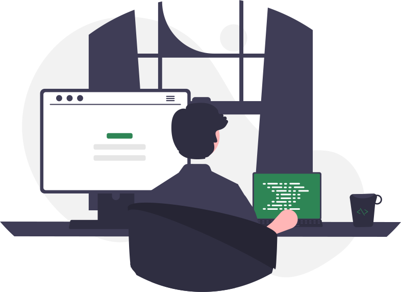
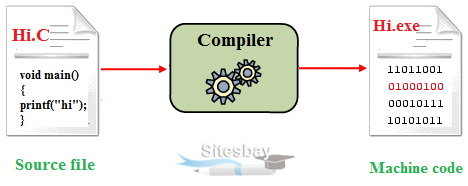

# programming fundamental


## Basic terminology in Programming

Before we go through Golang and Javascript coding, and all the good stuff that comes with it, it's essential to understand how computers understand the program that humans write. Hence, we will go through some basic terminology and concepts that will make your foundation concepts robust. Additionally, you can apply these concepts to any programming language and not just Golang or javascript. So without further ado, let's get started!

## what is a Program?

program is set of instructions given to a computer to perform specific tasks. The collection of instructions in a file is also known as **source code**. It's a file that has separate extensions like .go, .js, .mod, etc., for Golang, javascript, golang modules respectively. Below is an example simple Golang program.
```go
package main

import "fmt"

func main() {
	fmt.Println("Hello World!")
}
```

Don't worry about the program. We will learn to write programs in subsequent articles. The program or instructions which we are trying to write in a high-level programming language is also known as source code. There are many names for the code we write. Please make sure you don't get confused with the names

## What is Programming?

is the act of Writing a set of instructions for a specific task to be done by the computer is known as Programming.

Computers are fast, cheap, high accuracy and lightning speed

Do computers complete a task by themselves?

No, they can't perform without the help of humans. We have to give instructions to the computer to perform specific tasks.

## What is a Programming Language?

Computers don't understand our languages like Hausa, Yoruba, English, etc. Computers only understand 0's and 1's. The vocabulary, which consists of 0's and 1's, is called Machine Language also known as Low-Level Language

It's challenging for us to write instructions in 0's and 1's. Therefore, we humans created a style to give instructions to the computers for the completion of specific tasks, i.e., **Programming Language.** Programming languages are also known as High-Level Languages, which can be understood by human beings.

Some of the High-Level programming languages are Golang, JavaScript, Python, C++, etc.

There is another language called Assembly Language, which converts our human-readable code, i.e., programming language to an assembly-level language. Assembly language is also known as low-level language. It is mostly used for microprocessors and programmable devices, which directly deal with the hardware. In addition to this, we don't have to know much about assembly-level language now. You can take the help of the internet in case you need to learn more about it.

# Terminology

Every language, including Natural Languages, which we are using in our daily conversations, has some rules to follow. Let's see them one by one.

## Alphabets

Any language in this world has a particular set of symbols to form words. English has English alphabets Moreover, Alphabets are building blocks of the language. likewise, programming language makes use of English alphabets and symbols in a special way

## Lexis

A collection of words that a language has to create sentences. Prepositions, Articles, etc. in English.

In programming, we call them keywords. Every programming language has a set of predefined words that we need to use to write instructions.

The following keywords are reserved and may not be used as identifiers.
```go

break  default  func   interface   select case  

defer  go  map  struct chan else    goto   package 

switch const   fallthrough  if range   type continue   

for   import       return       var


```
## Syntax

A set of rules to examine whether the sentence is valid or not. We need to arrange the words of a language in a well-defined format to form correct sentences. In the same manner, we need to write instructions for the computer that are valid and should be understood by the computer. Moreover, the arrangement of words and phrases to create well-formed sentences in a language happens. In the context of computers, it refers to the proper ordering of symbols and codes which, in turn, helps the computer to understand what instructions are telling it to do.

## Semantics

A set of rules to examine whether a phrase is making any sense or not. We need to create sentences that make sense to use. Therefore, in programming, we need to make sure our instructions are well-semantic. We will know more about the above terminology in terms of programming in detail when we start writing the code. Don't bother about the vocabulary, even if you don't understand it now.

# How to execute Programs?

Now that we have written a program(source code), what to do with it. We have to run it to get the output. To execute our programs, we need a tool i.e.,

1. Compiler, or Interpreter.

2. Text Editor

3. IDE (Integrated Development Environment)

## What is a Compiler?


A compiler is a software application that takes the set of instructions(program) you have written and validates them according to the language syntax. If everything is good, it will give you the output. The compiler will throw errors if the code is not valid. Moreover, different programming languages have different compilers. Languages like Golang use Go compiler C, C++, use the GCC compilers respectively to execute the programs.

Additionally, the compiler will go through different stages in the execution process. In the end, it converts the instructions into Machine Language that can be understood by the computer. It generates an executable file. Therefore, we don't have to execute the program every time to see the result.

## What is an Interpreter in Programming?


An interpreter is also similar to a compiler. It validates the syntax and gives you the result if everything is correct.

Languages like javascript, Python, etc. use the interpreter. It converts the source code into an intermediate form and then executes it. Additionally, we have to run the program every time to see the result.

## Text Editor

A text editor is a type of computer program that edits plain text. Such programs are sometimes known as "notepad" software (e.g. Windows Notepad). Text editors are provided with operating systems and software development packages, and can be used to change files such as configuration files, documentation files and programming language source code.

IDE (Integrated Development Environment)

An integrated development environment (IDE) is a software application that provides comprehensive facilities to computer programmers for software development.

An IDE normally consists of at least a source code editor, build automation tools and a debugger. Some IDEs, such as NetBeans and Eclipse, contain the necessary compiler, interpreter, or both.

conclude

we have learned a lot. Knowing this basic stuff is essential before moving into the actual programming for beginners. I hope you enjoyed this piece.

