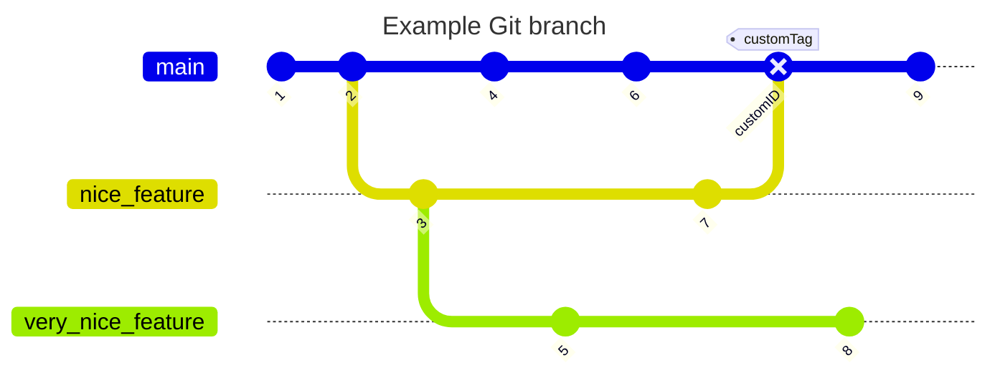

# working with Git


if you installed git in your computer

Open your bash terminal

## Set a git username globally

```bash
git config --global user.name "your_user_name"

```

Set a git email globally


Confirm that you have set your git details correctly

## There are two way get a repository 

### What is a repository?:

A repository is a **project** containing files and **folders**. A repository **tracks** versions of files and folders.

1. Initialize locally with git 

###

```bash
mkdir project-name

cd project-name

git init
```


2. or clone (Download) remote repository from github

Create a new branch for the aspect of the project you want to work on and change the current working directory to your new branch


# What is a branch?: 

A branch is a parallel version of your repository. By default, your repository has one branch named main and it is considered to be the definitive branch. You can create additional branches off of main in your repository. You can use branches to have different versions of a project at one time.

## Git branch Workflow

### Master Branch: 
This is a replica of the code in production. No one is allowed to code directly on this branch.

### Release Branch: 
This is created from the master branch. This becomes necessary when multiple projects are running on the same code base e.g. when paying your technical debts by trying to get rid of legacy code. To work on a feature, you need to create another branch from this branch.

### Feature Branch: 
For every feature added, there should be a feature branch. This ensures parallel developments making rollbacks and cherrypicking easier.




## You created a branch! 

Creating a branch allows you to edit your project without changing the main branch. Now that you have a branch, it’s time to create a file and make your first commit!


